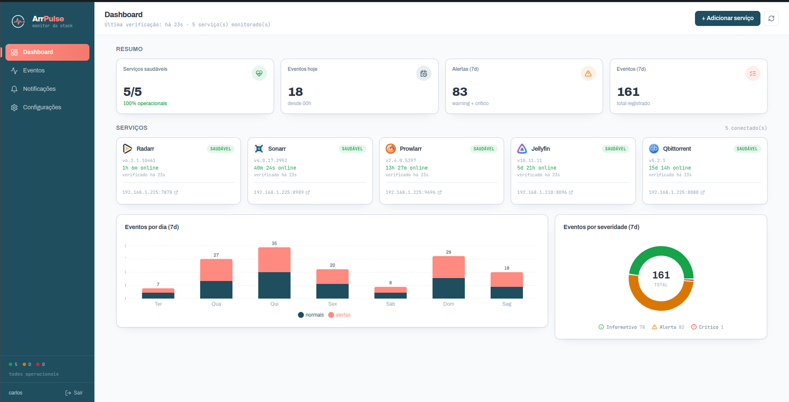
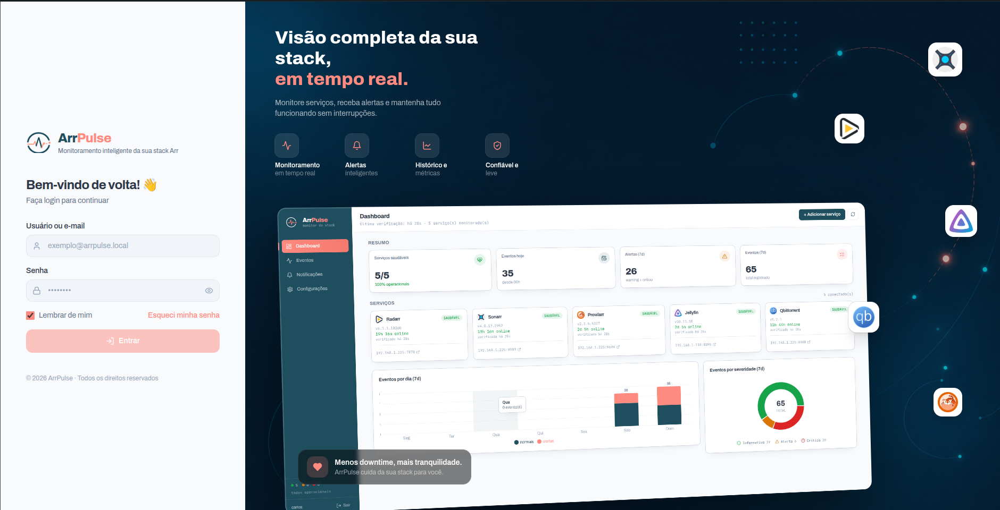

# ArrPulse

Monitor de saúde do stack *arr* — **Radarr, Sonarr, Prowlarr, Jellyfin e qBittorrent** — com dashboard, feed de eventos em tempo real e notificações push no celular.

> Imagem: `ghcr.io/carlosj188/arr-watch` · porta `8080` · container único · dados em SQLite.
> O produto se chama **ArrPulse**; a pasta/imagem mantêm o nome histórico `arr-watch`.

---

## Telas

**Dashboard** — saúde de cada serviço, resumo, eventos por dia e por severidade:



**Login** — acesso de usuário único:



---

## O que faz

- **Monitoramento de saúde** de cada serviço com estado **saudável / degradado / fora** e "saudável há X". Verificação a cada `POLL_INTERVAL` segundos (padrão 60s).
- **Anti-flapping:** só marca um serviço como *fora* depois de **2 verificações seguidas falhando** — um soluço isolado não dispara alarme.
- **Timeout configurável por serviço** (na própria UI, em segundos). Default por tipo: qBittorrent **12s**, demais **6s**. Vazio = automático.
- **Notificações push:** ntfy, Discord e Telegram (transições de status, importações, alertas).
- **Webhooks dos arr em tempo real:** Radarr/Sonarr/Prowlarr mandam *On Grab / On Import / On Upgrade / On Health Issue* direto pro feed.
- **Detecção de idioma** dos imports (opcional).
- **Horário silencioso** (quiet hours) com opção de ainda deixar passar alertas críticos.
- **Digest diário** de itens faltantes (wanted/missing) do Radarr/Sonarr.
- **qBittorrent:** detecção de torrents travados (erro / arquivos ausentes / download estagnado).
- **Login de usuário único** (sessão stateless por token HMAC).

---

## Segurança

- API keys e senhas dos serviços são **criptografadas em AES-256-GCM** com o `APP_SECRET` antes de ir pro banco.
- Senha de login com **scrypt + salt**; token de sessão **HMAC-SHA256** stateless.
- **Gere um `APP_SECRET` forte e fixo** — se ele mudar, as credenciais salvas no banco ficam ilegíveis.

---

## Stack

- **Backend:** Fastify 5 (Node 22) + SQLite (`better-sqlite3`), ESM.
- **Frontend:** React 18 + Vite + Tailwind + Recharts (tema claro). Buildado e servido estático pelo próprio Fastify — **container único**.
- **Persistência:** um arquivo SQLite no volume `./data`.

---

## Instalação

Guia completo em **[INSTALL.md](./INSTALL.md)**. Resumo:

```bash
cp .env.example .env
# edite e gere o APP_SECRET:  openssl rand -hex 32
docker compose up -d
```

Acesse `http://IP-DO-HOST:8080`, crie o usuário no primeiro acesso e adicione os serviços.

---

## Como conectar cada serviço

| Serviço | Auth | Onde pegar | Porta padrão |
|---|---|---|---|
| Radarr | API key (`X-Api-Key`) | Settings → General → Security | `:7878` |
| Sonarr | API key (`X-Api-Key`) | Settings → General → Security | `:8989` |
| Prowlarr | API key (`X-Api-Key`, API v1) | Settings → General → Security | `:9696` |
| Jellyfin | nenhuma p/ saúde (`/System/Info/Public`) | — | `:8096` |
| qBittorrent | usuário + senha (login por cookie) | login do WebUI | `:8080` |

**qBittorrent:**
- Pode deixar usuário/senha em branco se liberar o IP do app em *Options → Web UI → Bypass authentication for clients in whitelisted IP subnets*.
- 401/403 mesmo com login certo → desmarque *Enable Host header validation* (ou adicione o host).
- Compatível com qBittorrent 5.2+ (login `204 No Content`, cookie `QBT_SID_<porta>`).
- Sob carga de disco a WebUI dele pode ficar lenta; o timeout maior (12s) + debounce de 2 falhas evita alarme falso. Ajuste o timeout no card do serviço se precisar.

---

## Webhooks dos arr (tempo real)

1. No card do serviço, clique **webhook** para copiar a URL.
2. No Radarr/Sonarr/Prowlarr: **Settings → Connect → + → Webhook**, cole a URL, **Method: POST**.
3. Marque os gatilhos (*On Grab*, *On Import*, *On Upgrade*, *On Health Issue*; no Prowlarr só *On Health Issue*).
4. **Test** → deve aparecer "Webhook conectado" no feed → **Save**.

---

## Estrutura do repositório

```
.
├── docker-compose.yml      # kit de deploy (aponta pra imagem no ghcr)
├── .env.example            # variáveis de ambiente (copie pra .env)
├── INSTALL.md              # guia de instalação passo a passo
├── docs/screenshots/       # capturas usadas no README
└── src/                    # código-fonte (única cópia editável)
    ├── Dockerfile          # build multi-stage → container único
    ├── backend/            # Fastify 5 + SQLite (better-sqlite3), ESM
    └── frontend/           # React 18 + Vite + Tailwind + Recharts
```

### Build da imagem

O `src/Dockerfile` é multi-stage: builda o frontend (Vite), instala o backend e serve
tudo num **container único** pelo próprio Fastify.

```bash
cd src
docker build -t ghcr.io/carlosj188/arr-watch:<versão> .
docker push  ghcr.io/carlosj188/arr-watch:<versão>
```

Depois é só apontar a tag no `docker-compose.yml` e `docker compose pull && up -d`.

---

## Versões

- **1.0.9** — redesign do painel de configurações em 4 abas (Canais · Eventos · Agenda · Silêncio) com interruptor-mestre "Push global"; modais unificados (Esc fecha, backdrop petróleo); fontes Archivo + JetBrains Mono.
- **1.0.7** — aviso diário de atualização disponível (sem degradar o serviço), alerta de idioma sempre notifica, motivo do degradado real no card e resumo de downloads concluídos do qBittorrent.
- **1.0.0** — primeira imagem publicada no ghcr.io. Inclui anti-flapping (debounce de 2 falhas) e timeout configurável por serviço.
